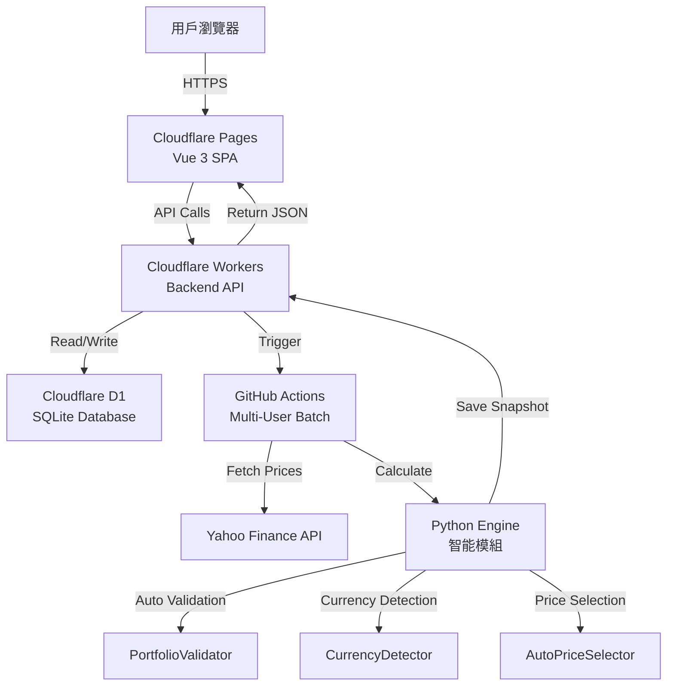

# 📋 SaaS Trading Journal PRO

<div align="center">


**現代化的投資組合追蹤與交易日誌系統**

專為美股/台股/韓股投資者設計，採用全 Serverless 架構  
高效能 | 低成本 | 即時數據 | PWA 支援 | 多人隔離

[🌐 Live Demo](https://sheet-trading-journal.pages.dev/) | [📖 Documentation](https://github.com/chihung1024/sheet-trading-journal/blob/main/DEPLOYMENT_FINAL.md) | [🐛 Report Bug](https://github.com/chihung1024/sheet-trading-journal/issues)

</div>

---

## 📑 目錄

- [功能特色](#-功能特色)
- [系統架構](#-系統架構)
- [智能模組](#-智能模組-new-v248)
- [核心金融演算法](#-核心金融演算法)
- [快速開始](#-快速開始)
- [環境配置](#-環境配置)
- [API 文檔](#-api-文檔)
- [數據庫設計](#️-資料庫設計)
- [部署指南](#-部署指南)
- [安全性配置](#-安全性配置)
- [更新記錄](#-更新記錄)
- [故障排除](#-故障排除)
- [貢獻指南](#-貢獻指南)

---

## ✨ 功能特色

### 🎯 核心功能

#### 📊 **智能儀錶板**
- **總資產 (NAV)**：即時計算投資組合淨值
- **未實現損益**：當前持倉的浮動盈虧
- **✅ 已實現損益** (v1.2.0)：追蹤所有賣出收益與配息收入
- **ROI**：投資回報率 (Return on Investment)
- **TWR**：時間加權報酬率，消除資金流入/流出影響
  - ✅ **v2.39**: 正確處理當沖/清倉情況
  - 當沖損益計入已實現損益，不影響 TWR
- **XIRR**：個人年化報酬率 (Internal Rate of Return)
- **✅ 當日損益精確計算** (v2.48)：
  - **分離計算**：已實現損益 + 未實現損益
  - **智能基準**：TransactionAnalyzer 加權基準價
  - **自動處理**：當沖、清倉、盤前盤後
  - **匯率對齊** (v2.52)：價格與匯率時點嚴格一致

#### 📈 **進階圖表分析**
- **趨勢圖** (v2.48 UI 優化)：
  - 投資組合歷史走勢
  - vs. **自訂 Benchmark** (SPY/QQQ/TQQQ/0050.TW 等) ✅ **v2.38**
  - ✅ **群組獨立時間軸** (v2.39.1)：每個群組從自己的第一筆交易日期開始顯示
  - ✅ **虛擬零點起始** (v2.39.1)：第一筆交易前一天自動插入 0 資產記錄
  - **直線圖設計** (v2.48)：更清晰的視覺效果
  - **IB 風格顯示** (v2.48)：區間最終數值標註
  - 自動排除週末數據
  - 支援時間範圍篩選 (1M/3M/6M/1Y/All)
- **配置圖**：
  - 圓餅圖顯示各持倉佔比
  - 產業分佈分析
  - 即時市值權重

#### 💼 **持倉管理**
- 即時市場價格更新
- FIFO 成本基礎追蹤
- 自動拆股/配息調整 (v2.46 全域復權)
- 每檔持倉的：
  - 均價 (Average Cost)
  - 現價 (Current Price)
  - 未實現損益 (Unrealized P&L)
  - 市值 (Market Value)
  - 權重 (Weight %)
  - 今日變動 (Daily Change)
  - 當日損益 (Daily P&L) - 含已實現 + 未實現

#### 📝 **交易日記**
- **CRUD 管理**：新增、編輯、刪除交易紀錄
- **多種交易類型**：
  - `BUY` - 買入
  - `SELL` - 賣出
  - `DIV` - 股息
- **精確稅費紀錄**：
  - 手續費 (Fee)
  - 預扣稅 (Tax)
  - 淨回報自動計算
- **策略標籤 (Tag)**：
  - 長線 (Long-term)
  - 短線 (Short-term)
  - 動能選股 (Momentum)
  - 自定義標籤
- **✅ 智能匯率處理** (v2.48)：台股交易自動識別，不乘匯率

#### 🏷️ **策略群組管理** ✨ **v2.39.1**
- **獨立時間軸**：每個群組使用自己的交易日期範圍
  - All 群組：從最早的交易開始
  - 長線群組：從長線策略第一筆交易開始
  - 短線群組：從短線策略第一筆交易開始
- **虛擬零點起始**：
  - 自動在第一筆交易前一天補上 0 資產記錄
  - 智能排除周末（如第一筆是周一，零點在上周五）
  - 讓資產增長軌跡從 0 開始，視覺化更清晰
- **獨立績效追蹤**：
  - 每個群組有獨立的 TWR/XIRR 計算
  - 獨立的持倉清單與配息記錄
  - 可比較不同策略的績效差異

#### 👥 **多人隔離架構** ✨ **NEW**
- **用戶級別數據隔離**：每位用戶的交易數據完全獨立
- **批次處理**：GitHub Actions 自動處理所有用戶
- **獨立快照**：每位用戶有自己的 portfolio snapshot
- **安全性**：基於 Google OAuth 的 user_id 識別

### 🎨 使用者體驗

#### 📱 **PWA (Progressive Web App)**
- 可安裝至桌面或手機
- 支援離線訪問
- 原生 App 般的體驗
- 推送通知支援 (未來功能)

#### 🌓 **深色模式**
- 自動跟隨系統設定
- 手動切換深色/淺色主題
- 護眼設計

#### 📐 **響應式設計**
- Desktop (1920px+)
- Laptop (1366px)
- Tablet (768px)
- Mobile (375px)
- 完美適配所有裝置

### 🔒 安全性

- **Google OAuth 2.0**：企業級身份驗證
- **JWT Token**：無狀態 Session 管理
- **CORS 保護**：防止跨域攻擊
- **API Key 驗證**：內部 API 保護
- **SQL 注入防護**：Prepared Statements
- **✅ Content Security Policy** (v2.39)：完整的 CSP 配置
  - 防止 XSS 攻擊
  - 允許必要的外部資源
  - 支援 Google 登入

---

## 🏭 系統架構

### 整體架構圖



### 技術堆疊

| 層級 | 技術 | 說明 | 成本 |
|------|------|------|------|
| **前端** | Vue 3 + Vite | SPA 單頁應用 | **免費** |
| **託管** | Cloudflare Pages | 全球 CDN 部署 | **免費** |
| **後端** | Cloudflare Workers | Serverless API | **免費** (100k req/day) |
| **資料庫** | Cloudflare D1 | 邊緣 SQLite | **免費** (5GB storage) |
| **運算** | GitHub Actions | 定期計算 + 多人批次 | **免費** (2000 min/month) |
| **身份驗證** | Google OAuth 2.0 | JWT Token | **免費** |
| **數據源** | Yahoo Finance | 股價/匯率 | **免費** |

**總成本：$0 USD/月** 🎉

---

## 🤖 智能模組 ✨ **NEW (v2.48)**

### 1️⃣ CurrencyDetector - 自動貨幣識別

**檔案位置**: `journal_engine/core/currency_detector.py`

#### 功能特點

- **自動市場識別**：根據股票代碼後綴自動判斷所屬市場
- **智能匯率處理**：
  - 台股 (.TW, .TWO) → 不需匯率轉換 (multiplier = 1.0)
  - 美股 (無後綴) → 需要 USD/TWD 匯率轉換
  - 韓股 (.KS, .KQ) → 需要 KRW/TWD 匯率轉換
- **幣別檢測**：返回標的對應的貨幣代碼 (TWD, USD, KRW)

#### 使用範例

```python
detector = CurrencyDetector()

# 判斷是否為台股
is_tw = detector.is_base_currency("2330.TW")  # True
is_tw = detector.is_base_currency("AAPL")     # False

# 取得有效匯率乘數
fx_multiplier = detector.get_fx_multiplier("2330.TW", 32.5)  # 1.0 (台股)
fx_multiplier = detector.get_fx_multiplier("AAPL", 32.5)     # 32.5 (美股)

# 檢測幣別
currency = detector.detect("0050.TW")  # "TWD"
currency = detector.detect("NVDA")     # "USD"
```

#### 支援的市場後綴

| 市場 | 後綴 | 基礎貨幣 |
|------|------|---------|
| 台灣證交所 | .TW | TWD |
| 台灣櫃買中心 | .TWO | TWD |
| 美國市場 | (無) | USD |
| 韓國交易所 | .KS | KRW |
| 韓國科斯達克 | .KQ | KRW |

---

### 2️⃣ PortfolioValidator - 自動驗證

**檔案位置**: `journal_engine/core/validator.py`

#### 功能特點

- **每日資產平衡驗證**：確保持倉成本與投入資金一致
- **TWR 計算驗證**：檢查時間加權報酬率的計算正確性
- **異常自動告警**：發現不一致時自動記錄警告日誌

#### 驗證邏輯

```python
validator = PortfolioValidator()

# 驗證每日資產平衡
validator.validate_daily_balance(holdings, invested_capital, current_holdings_cost_sum)
# 檢查：sum(h['cost_basis_twd'] for h in holdings) ≈ invested_capital

# 驗證 TWR 計算
validator.validate_twr_calculation(history_data)
# 檢查：每日 TWR 累積是否連續且合理
```

#### 自動檢測項目

1. **資產平衡**：持倉成本總和 vs. 投入資金
2. **TWR 連續性**：確保沒有跳躍或異常值
3. **數值合理性**：檢查極端值 (如 TWR > 1000%)

---

### 3️⃣ AutoPriceSelector - 智能價格選擇

**檔案位置**: `journal_engine/clients/auto_price_selector.py`

#### 功能特點

- **自動欄位選擇**：根據市場特性選擇正確的價格欄位
- **台股特殊處理**：使用原始 `Close` 價格（非復權價）
- **美股標準處理**：使用 `Adj Close` 復權價格
- **容錯機制**：欄位缺失時自動降級處理

#### 價格選擇邏輯

```python
selector = AutoPriceSelector()

# 台股 - 使用原始收盤價
price = selector.get_price(tw_stock_data, "2330.TW")
# 優先順序: Close → Adj Close → 最後可用價格

# 美股 - 使用復權價格
price = selector.get_price(us_stock_data, "AAPL")
# 優先順序: Adj Close → Close → 最後可用價格
```

#### 為什麼台股不用復權價？

- **Yahoo Finance 台股數據問題**：`Adj Close` 可能包含不正確的除息調整
- **台股交易習慣**：投資者習慣查看原始價格
- **手動復權處理**：系統在 `_back_adjust_transactions_global()` 中手動處理台股拆股

---

## 📢 核心金融演算法

### 1️⃣ FIFO 成本計算

採用 **先進先出 (First-In-First-Out)** 原則，精確追蹤成本基礎。

#### 算法實現

```python
class FIFOTracker:
    def __init__(self):
        self.lots = []  # [(date, qty, price, fee), ...]
    
    def buy(self, date, qty, price, fee):
        cost_per_share = (price * qty + fee) / qty
        self.lots.append((date, qty, cost_per_share))
    
    def sell(self, qty):
        remaining = qty
        realized_pnl = 0
        
        while remaining > 0 and self.lots:
            lot_date, lot_qty, lot_cost = self.lots[0]
            
            if lot_qty <= remaining:
                # 賣完這一批
                realized_pnl += (sell_price - lot_cost) * lot_qty
                remaining -= lot_qty
                self.lots.pop(0)
            else:
                # 部分賣出
                realized_pnl += (sell_price - lot_cost) * remaining
                self.lots[0] = (lot_date, lot_qty - remaining, lot_cost)
                remaining = 0
        
        return realized_pnl
```

---

### 2️⃣ 全域復權處理 ✨ **v2.46**

在計算開始前，統一處理所有交易的拆股與配息調整。

#### 實現邏輯

```python
def _back_adjust_transactions_global(self):
    """全域復權處理 - 統一調整歷史交易"""
    for index, row in self.df.iterrows():
        sym = row['Symbol']
        date = row['Date']
        
        # 取得拆股倍數
        split_factor = self.market.get_transaction_multiplier(sym, date)
        
        # 台股特殊處理：只處理拆股，不處理配息
        is_tw = self._is_taiwan_stock(sym)
        if is_tw:
            div_adj_factor = 1.0
        else:
            div_adj_factor = self.market.get_dividend_adjustment_factor(sym, date)
        
        # 調整數量與價格
        if split_factor != 1.0 or div_adj_factor != 1.0:
            new_qty = row['Qty'] * split_factor
            new_price = (row['Price'] / split_factor) * div_adj_factor
            
            self.df.at[index, 'Qty'] = new_qty
            self.df.at[index, 'Price'] = new_price
```

#### 處理範例

**情境：NVDA 10:1 拆股 (2024-06-10)**

```
原始交易 (2024-01-15):
- 買入 10 股 @ $500/股 = $5,000

復權後 (2024-06-10 後查詢):
- 買入 100 股 @ $50/股 = $5,000
  (數量 × 10, 價格 ÷ 10, 總成本不變)
```

**影響**:
- ✅ 所有歷史交易自動對齊當前股價
- ✅ 持倉數量正確反映拆股後狀態
- ✅ 配息計算基於正確的持股數 (v2.44)

---

### 3️⃣ 時間加權報酬率 (TWR) ✅ **v2.39 重大更新**

使用 **Modified Dietz 方法**，消除資金流影響。

#### 計算公式

```python
# 每日報酬率計算
period_hpr_factor = 1.0

# 情況 1：正常情況 - 期初有市值
if last_market_value_twd > 1e-9:
    period_hpr_factor = (current_market_value_twd - daily_net_cashflow_twd) / last_market_value_twd

# 情況 2：首次投資 - 期初無市值但期末有市值
elif current_market_value_twd > 1e-9 and daily_net_cashflow_twd > 1e-9:
    period_hpr_factor = current_market_value_twd / daily_net_cashflow_twd

# 情況 3：當沖或清倉後收配息 - 期初期末都無市值 ✅ NEW
elif current_market_value_twd < 1e-9 and last_market_value_twd < 1e-9:
    period_hpr_factor = 1.0  # 不影響 TWR，損益計入 realized_pnl

# 累積報酬率
TWR = ∏(period_hpr_factor) - 1
```

#### 當沖交易的處理 ✅ **NEW v2.39**

**問題：** 當沖交易（期初期末都無持倉）會導致 TWR 計算異常

**解決方案：**
- 當 MVB=0 且 MVE=0 時，設定 `period_hpr_factor = 1.0`
- 當沖損益正確計入 `realized_pnl`（已實現損益）
- TWR 只反映「持倉期間」的投資表現

---

### 4️⃣ 匯率對齊機制 ✨ **v2.52 徹底修復**

確保資產價格與匯率的時點嚴格一致，解決「美股未開盤但台幣波動」的問題。

#### 核心邏輯

```python
def _get_asset_effective_price_and_fx(self, symbol, target_date, current_fx):
    """
    確保價格與匯率時點嚴格一致
    
    修復邏輯：
    1. 歷史日期：價格和匯率都使用該日期的收盤數據
    2. 今天 (美股未開)：價格用昨天收盤，但匯率使用【今日即時】(current_fx)
       - 修正重點：確保資產價值反映今日台幣波動
    3. 今天 (美股盤中/收盤)：價格和匯率都用今天即時數據
    """
    
    is_tw = self._is_taiwan_stock(symbol)
    if is_tw:
        # 台股簡單：不需要匯率
        price = self.market.get_price(symbol, pd.Timestamp(target_date))
        return price, 1.0
    
    # === 美股邏輯 ===
    tw_now = datetime.now(self.pnl_helper.tz_tw)
    today = tw_now.date()
    
    # 情況 A: 歷史日期
    if target_date < today:
        price = self.market.get_price(symbol, pd.Timestamp(target_date))
        fx_to_use = self.market.fx_rates.asof(pd.Timestamp(target_date))
        return price, self._get_effective_fx_rate(symbol, fx_to_use)
    
    # 情況 B: 今天 - 美股未開盤
    us_open = self._is_us_market_open(tw_now)
    if not us_open:
        # ✅ 價格：昨天收盤
        # ✅ 匯率：今日即時 (current_fx)
        prev_date = today - timedelta(days=1)
        while prev_date.weekday() >= 5:
            prev_date -= timedelta(days=1)
        
        price = self.market.get_price(symbol, pd.Timestamp(prev_date))
        fx_to_use = current_fx  # 使用即時匯率
        
        return price, self._get_effective_fx_rate(symbol, fx_to_use)
    
    # 情況 C: 今天 - 美股盤中
    else:
        price = self.market.get_price(symbol, pd.Timestamp(today))
        fx_to_use = current_fx
        return price, self._get_effective_fx_rate(symbol, fx_to_use)
```

#### 實際效果

**場景：台灣時間下午 2 點 (美股未開盤)**

```
情境：
- 持有 AAPL 100 股
- 美股昨日收盤價：$150
- 昨日匯率：32.0
- 今日即時匯率：32.5 (台幣貶值)

修復前 (錯誤):
資產價值 = 100 × $150 × 32.0 = NT$ 480,000
❌ 無法反映今日台幣波動

修復後 (正確):
資產價值 = 100 × $150 × 32.5 = NT$ 487,500
✅ 正確反映今日匯率影響
```

---

### 5️⃣ 當日損益計算 ✨ **v2.48 完整實現**

採用 **TransactionAnalyzer + 加權基準價** 方法，精確計算已實現與未實現損益。

#### 核心實現

```python
# 1. 分析今日交易
position_snap = txn_analyzer.analyze_today_position(sym, effective_display_date, effective_fx)
realized_pnl_today = position_snap.realized_pnl

# 2. 計算未實現損益
if position_snap.qty > 0:
    # 使用加權基準價 (考慮今日買入)
    weighted_base = txn_analyzer.get_base_price_for_pnl(position_snap, base_prev_close)
    unrealized_pnl_today = (curr_p - weighted_base) * position_snap.qty * effective_fx

# 3. 總當日損益
total_daily_pnl = realized_pnl_today + unrealized_pnl_today

# 4. 最終加總
display_daily_pnl = sum(h.daily_pl_twd for h in final_holdings)
```

#### 處理情境

| 情境 | 已實現損益 | 未實現損益 | 說明 |
|------|----------|----------|------|
| **持倉未動** | 0 | (今收 - 昨收) × 持股 | 市值波動 |
| **今日買入** | 0 | (今收 - 今買) × 持股 | 使用買入價作基準 |
| **今日賣出** | 賣出損益 | (今收 - 昨收) × 剩餘持股 | FIFO 計算 |
| **當沖** | 賣出損益 | 0 | 持股=0 |
| **清倉** | 賣出損益 | 0 | 持股=0 |

#### 設計優勢

1. **精確性**：分離已實現與未實現損益，邏輯清晰
2. **智能基準**：當日買入使用買入價，避免虛增損益
3. **自動處理**：TransactionAnalyzer 自動處理各種交易組合
4. **維護性**：模組化設計，易於測試和調試

---

### 6️⃣ 群組獨立時間軸計算 ✨ **v2.39.1**

每個策略群組使用自己的交易日期範圍進行計算。

#### 計算邏輯

```python
for group_name in groups_to_calc:
    if group_name == 'all':
        group_df = self.df.copy()
    else:
        # 篩選該群組的交易記錄
        mask = self.df['Tag'].apply(
            lambda x: group_name in [t.strip() for t in (x or '').replace(';', ',').split(',')]
        )
        group_df = self.df[mask].copy()
    
    # ✨ 每個群組使用自己的日期範圍
    group_start_date = group_df['Date'].min()
    group_end_date = datetime.now()
    group_date_range = pd.date_range(start=group_start_date, end=group_end_date, freq='D')
```

#### 虛擬零點起始

```python
def _get_previous_trading_day(self, date):
    """獲取前一個交易日（排除周末）"""
    prev_date = date - timedelta(days=1)
    while prev_date.weekday() >= 5:  # 5=周六, 6=周日
        prev_date -= timedelta(days=1)
    return prev_date

# 插入虛擬 0 資產記錄
if not df.empty:
    first_tx_date = df['Date'].min()
    prev_trading_day = self._get_previous_trading_day(first_tx_date)
    
    history_data.append({
        "date": prev_date_str, 
        "total_value": 0,
        "invested": 0, 
        "twr": 0.0,
        ...
    })
```

---

## 🔐 安全性配置

### Content Security Policy (CSP) ✅ **v2.39**

專案已實施完整的 CSP 安全策略。

#### 配置文件

1. **`public/_headers`** - Cloudflare Pages HTTP Headers
2. **`index.html`** - HTML Meta Tag CSP

#### CSP 策略

```http
Content-Security-Policy: 
  default-src 'self'; 
  script-src 'self' 'unsafe-inline' 'unsafe-eval' 
    https://accounts.google.com 
    https://apis.google.com; 
  style-src 'self' 'unsafe-inline' 
    https://fonts.googleapis.com; 
  font-src 'self' 
    https://fonts.gstatic.com 
    https://r2cdn.perplexity.ai; 
  img-src 'self' data: https: 
    https://lh3.googleusercontent.com; 
  connect-src 'self' 
    https://journal-backend.chired.workers.dev; 
  frame-src https://accounts.google.com;
```

---

## 🆕 更新記錄

### v2.52 (2026-01-28) ✅ **LATEST**

**🔧 匯率對齊徹底修復**

**修復內容：**
```python
def _get_asset_effective_price_and_fx(self, symbol, target_date, current_fx):
    """
    [v2.52 徹底修復] 確保價格與匯率時點嚴格一致
    
    修復邏輯：
    1. 歷史日期：價格和匯率都使用該日期的收盤數據
    2. 今天 (美股未開)：價格用昨天收盤，但匯率使用【今日即時】
    3. 今天 (美股盤中)：價格和匯率都用今天即時數據
    """
```

**影響範圍：**
- ✅ 資產價值正確反映今日台幣波動
- ✅ 歷史回測數據時點嚴格對齊
- ✅ 解決「美股未開但台幣大漲」資產不動的問題

**相關 Commits：**
- [`64f1f82`](https://github.com/chihung1024/sheet-trading-journal/commit/64f1f82) - feat(v2.52): 新增專業級市場時段檢測器
- [`c0256b7`](https://github.com/chihung1024/sheet-trading-journal/commit/c0256b7) - fix(config): correct EXCHANGE_SYMBOL to TWD=X

---

### v2.48-v2.49 (2026-01-28)

**🤖 智能模組整合 + UI 優化**

**新增功能：**

1. **CurrencyDetector** - 自動貨幣識別
   ```python
   detector = CurrencyDetector()
   is_tw = detector.is_base_currency(symbol)
   fx_multiplier = detector.get_fx_multiplier(symbol, fx_rate)
   ```

2. **PortfolioValidator** - 自動驗證
   ```python
   validator = PortfolioValidator()
   validator.validate_daily_balance(holdings, invested_capital, cost_sum)
   validator.validate_twr_calculation(history_data)
   ```

3. **AutoPriceSelector** - 智能價格選擇
   - 台股使用 `Close` (原始價格)
   - 美股使用 `Adj Close` (復權價格)

**UI 改進：**
- 直線圖取代曲線圖
- IB 風格區間最終數值顯示
- 隱藏 Y 軸刻度，增加圖表高度

**前端修復：**
- 台股交易記錄不乘匯率 (RecordList)
- Chart 數據台股使用 effective_fx_rate (1.0)

**相關 Commits：**
- [`2d89e48`](https://github.com/chihung1024/sheet-trading-journal/commit/2d89e48) - [v2.48 UI] Chart: 直線圖 + IB style
- [`95c05d6`](https://github.com/chihung1024/sheet-trading-journal/commit/95c05d6) - feat: Add CurrencyDetector
- [`9e9e022`](https://github.com/chihung1024/sheet-trading-journal/commit/9e9e022) - feat: Add PortfolioValidator

---

### v2.46 (2026-01-27)

**📊 全域復權處理**

**新增功能：**

```python
def _back_adjust_transactions_global(self):
    """全域復權預處理 - 統一處理拆股與配息調整"""
    for index, row in self.df.iterrows():
        split_factor = self.market.get_transaction_multiplier(sym, date)
        
        # 台股特殊處理：只處理拆股
        if is_tw:
            div_adj_factor = 1.0
        else:
            div_adj_factor = self.market.get_dividend_adjustment_factor(sym, date)
        
        new_qty = row['Qty'] * split_factor
        new_price = (row['Price'] / split_factor) * div_adj_factor
```

**影響範圍：**
- ✅ 所有歷史交易自動對齊當前股價
- ✅ 持倉數量正確反映拆股狀態
- ✅ 台股與美股差異化處理

**相關 Commits：**
- [`80a77fd`](https://github.com/chihung1024/sheet-trading-journal/commit/80a77fd) - Fix Taiwan stock back-adjustment
- [`2fcb542`](https://github.com/chihung1024/sheet-trading-journal/commit/2fcb542) - Fix final holdings to use market.get_price()

---

### v2.44 (2026-01-27)

**💰 配息計算修正**

**修復內容：**

```python
# [v2.44 復權修正] 配息計算
split_factor = self.market.get_transaction_multiplier(sym, d)
shares_at_ex = h['qty'] / split_factor  # 還原除息日的持股數

total_gross = shares_at_ex * div_per_share
```

**影響：**
- ✅ 拆股後的配息金額正確計算
- ✅ 避免配息金額膨脹

**相關 Commits：**
- [`7415320`](https://github.com/chihung1024/sheet-trading-journal/commit/7415320) - Restore dividend adjustment logic

---

### v2.40 (未明確日期)

**📈 市場狀態獲取**

```python
# [v2.40] 獲取市場狀態
current_stage, stage_desc = self.pnl_helper.get_market_stage()
logger.info(f"當前市場狀態: {current_stage} ({stage_desc})")
```

---

### v2.39.1 (2026-01-21)

**📊 群組獨立時間軸與虛擬零點**

**新增功能：**
- 每個群組使用獨立的交易日期範圍
- 虛擬零點起始（第一筆交易前一天補 0 資產）
- 智能排除周末

**相關 Commits：**
- [`a1894f8`](https://github.com/chihung1024/sheet-trading-journal/commit/a1894f8) - 虛擬 0 資產記錄
- [`234dc9b`](https://github.com/chihung1024/sheet-trading-journal/commit/234dc9b) - 群組獨立日期範圍

---

### v2.39 (2026-01-21)

**🐛 TWR 計算修正 - 當沖/清倉處理**

**修復內容：**
```python
# 情況 3：當沖或清倉後收配息
elif current_market_value_twd < 1e-9 and last_market_value_twd < 1e-9:
    period_hpr_factor = 1.0  # 不影響 TWR
```

**CSP 完整配置：**
- 新增 `public/_headers`
- 更新 `index.html` CSP meta tag

**相關 Commits：**
- [`5865e3d`](https://github.com/chihung1024/sheet-trading-journal/commit/5865e3d) - 修正當沖 TWR
- [`12d794a`](https://github.com/chihung1024/sheet-trading-journal/commit/12d794a) - 新增安全標頭

---

### v2.38 (2026-01-19)

**🎯 自訂 Benchmark 功能**

- Worker v2.38 生產版本
- 前端 Benchmark 輸入
- GitHub Workflow 整合
- 支援 SPY/QQQ/TQQQ/0050.TW 等

---

### v2.0.0 (2026-01-09)

**匯率影響分離**
- 精準計算今日損益
- 新增 XIRR 計算

---

### v1.2.0 (2026-01-13)

**已實現損益追蹤**
- 新增已實現損益卡片
- 6 欄 Grid 佈局
- FIFO 完整實現

---

## 🛠️ 故障排除

### Q1: TWR 顯示 -100% 或異常值？

**解決方案：**
1. 確認版本 ≥ v2.39
2. 檢查 GitHub Actions 日誌
3. 查找「當沖/清倉情況: HPR設為1.0」訊息
4. 清除舊快照後重新計算

---

### Q2: 資產價值不隨台幣波動？

**原因：** v2.52 之前的匯率對齊問題

**解決方案：**
1. 確認版本 ≥ v2.52
2. 檢查 `_get_asset_effective_price_and_fx()` 方法
3. 美股未開盤時應使用「今日即時匯率」

---

### Q3: 當日損益計算不準？

**檢查項目：**
1. 使用 v2.48 版本（包含 TransactionAnalyzer）
2. 確認 `display_daily_pnl = sum(h.daily_pl_twd)`
3. 檢查已實現 + 未實現損益分離

---

### Q4: 台股價格異常？

**原因：** 可能使用了錯誤的復權價格

**解決方案：**
1. 確認 AutoPriceSelector 已整合 (v2.48)
2. 台股應使用 `Close` 而非 `Adj Close`
3. 檢查 `market_data.py` 的 `get_price()` 方法

---

## 🗺️ 路線圖

### 計劃中的功能

#### Q1 2026

- [ ] **多幣別支援** (EUR, JPY, GBP)
- [ ] **當沖績效獨立追蹤**
- [ ] **期權交易追蹤**

#### Q2 2026

- [ ] **進階績效指標** (Sharpe, Sortino, Calmar)
- [ ] **社群功能** (策略分享、排行榜)

#### Q3 2026

- [ ] **移動應用** (React Native)
- [ ] **AI 分析** (風險評估、配置建議)

---

## 📊 技術亮點總結

### 🏆 核心優勢

1. **零成本架構** - 100% Serverless，$0/月運行成本
2. **智能化模組** - 自動識別、自動驗證、自動選擇
3. **精確計算** - FIFO + TWR + XIRR + 復權處理
4. **多人隔離** - 企業級數據隔離與批次處理
5. **即時匯率** - 價格與匯率時點嚴格對齊 (v2.52)
6. **完整安全** - CSP + OAuth 2.0 + JWT + CORS

### 🎯 設計理念

- **自動化優先** - 減少手動配置，智能模組自動處理
- **精確性至上** - 每一筆計算都有驗證機制
- **可維護性** - 模組化設計，易於擴展和調試
- **用戶體驗** - PWA + 深色模式 + 響應式設計

---

<div align="center">

**Built with ❤️ by a quantitative trader for traders**

**Current Version: v2.52.0 (2026-01-28)**

[⭐ Star this project](https://github.com/chihung1024/sheet-trading-journal) | [🐛 Report bug](https://github.com/chihung1024/sheet-trading-journal/issues) | [💡 Request feature](https://github.com/chihung1024/sheet-trading-journal/issues)

</div>
