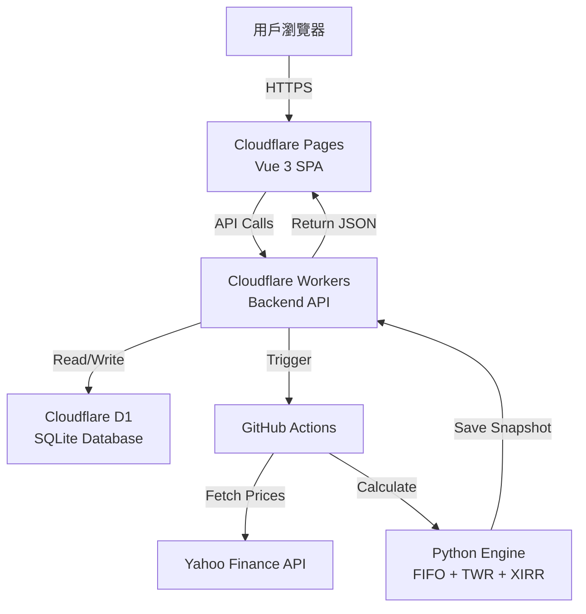
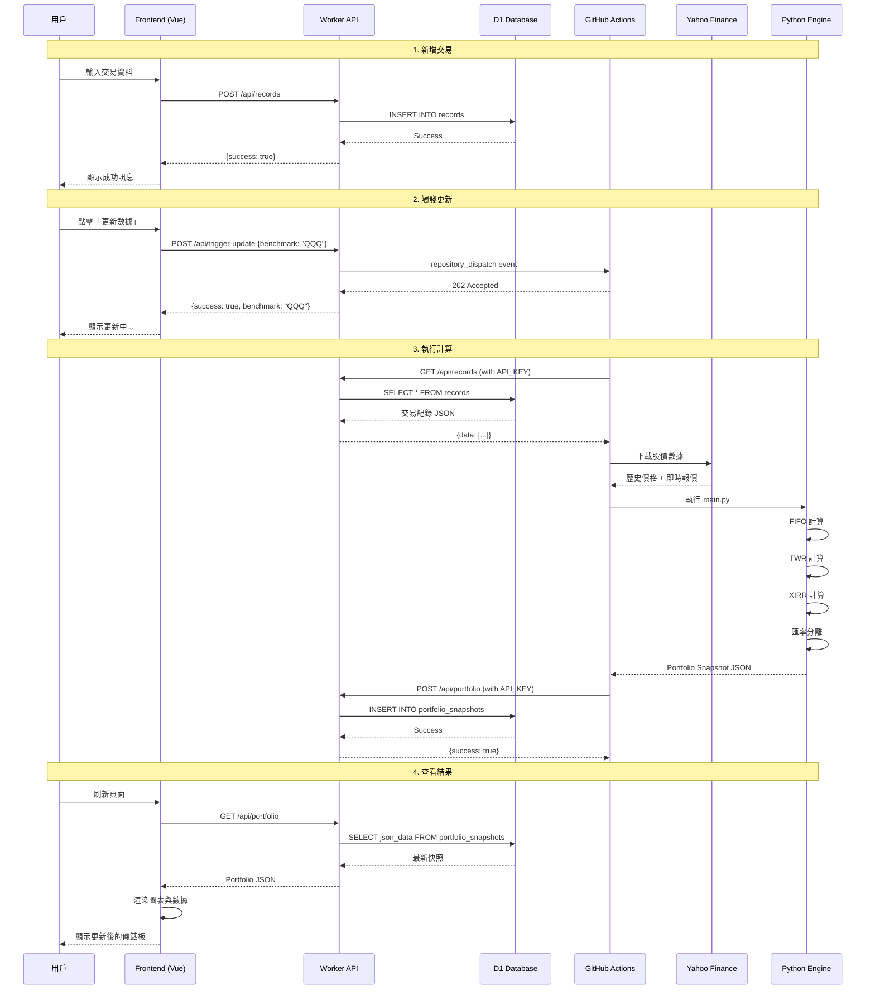

# 📋 SaaS Trading Journal PRO

<div align="center">


**現代化的投資組合追蹤與交易日誌系統**

專為美股/台股/韓股投資者設計，採用全 Serverless 架構  
高效能 | 低成本 | 即時數據 | PWA 支援

[🌐 Live Demo](https://sheet-trading-journal.pages.dev/) | [📖 Documentation](https://github.com/chihung1024/sheet-trading-journal/blob/main/DEPLOYMENT_FINAL.md) | [🐛 Report Bug](https://github.com/chihung1024/sheet-trading-journal/issues)

</div>

---

## 📑 目錄

- [功能特色](#-功能特色)
- [系統架構](#-系統架構)
- [核心金融演算法](#-核心金融演算法)
- [快速開始](#-快速開始)
- [環境配置](#-環境配置)
- [API 文檔](#-api-文檔)
- [數據庫設計](#️-資料庫設計)
- [部署指南](#-部署指南)
- [更新記錄](#-更新記錄)
- [故障排除](#-故障排除)
- [貢獻指南](#-貢獻指南)

---

## ✨ 功能特色

### 🎯 核心功能

#### 📊 **智能儀錶板**
- **總資產 (NAV)**：即時計算投資組合淨值
- **未實現損益**：當前持倉的浮動盈虧
- **✅ 已實現損益** (v1.2.0)：追蹤所有賣出收益與配息收入
- **ROI**：投資回報率 (Return on Investment)
- **TWR**：時間加權報酬率，消除資金流入/流出影響
- **XIRR**：個人年化報酬率 (Internal Rate of Return)
- **✅ 今日損益智能計算**：
  - 美股開盤前：顯示昨日變化 + 匯率影響
  - 美股盤中：即時盤中損益
  - 精準分離股價與匯率因素

#### 📈 **進階圖表分析**
- **趨勢圖**：
  - 投資組合歷史走勢
  - vs. **自訂 Benchmark** (SPY/QQQ/TQQQ/0050.TW 等) ✅ **NEW v2.38**
  - 自動排除週末數據
  - 支援時間範圍篩選 (1M/3M/6M/1Y/All)
- **配置圖**：
  - 圓餅圖顯示各持倉佔比
  - 產業分佈分析
  - 即時市值權重

#### 💼 **持倉管理**
- 即時市場價格更新
- FIFO 成本基礎追蹤
- 自動拆股/配息調整
- 每檔持倉的：
  - 均價 (Average Cost)
  - 現價 (Current Price)
  - 未實現損益 (Unrealized P&L)
  - 市值 (Market Value)
  - 權重 (Weight %)
  - 今日變動 (Daily Change)

#### 📝 **交易日記**
- **CRUD 管理**：新增、編輯、刪除交易紀錄
- **多種交易類型**：
  - `BUY` - 買入
  - `SELL` - 賣出
  - `DIV` - 股息
- **精確稅費紀錄**：
  - 手續費 (Fee)
  - 預扣稅 (Tax)
  - 淨回報自動計算
- **策略標籤 (Tag)**：
  - 長線 (Long-term)
  - 短線 (Short-term)
  - 動能選股 (Momentum)
  - 自定義標籤
- **✅ 台幣總額正確顯示**：使用交易當天匯率轉換

### 🎨 使用者體驗

#### 📱 **PWA (Progressive Web App)**
- 可安裝至桌面或手機
- 支援離線訪問
- 原生 App 般的體驗
- 推送通知支援 (未來功能)

#### 🌓 **深色模式**
- 自動跟隨系統設定
- 手動切換深色/淺色主題
- 護眼設計

#### 📐 **響應式設計**
- Desktop (1920px+)
- Laptop (1366px)
- Tablet (768px)
- Mobile (375px)
- 完美適配所有裝置

### 🔒 安全性

- **Google OAuth 2.0**：企業級身份驗證
- **JWT Token**：無狀態 Session 管理
- **CORS 保護**：防止跨域攻擊
- **API Key 驗證**：內部 API 保護
- **SQL 注入防護**：Prepared Statements
- **XSS 防護**：Content Security Policy

---

## 🏭 系統架構

### 整體架構圖



### 技術堆疊

| 層級 | 技術 | 說明 | 成本 |
|------|------|------|------|
| **前端** | Vue 3 + Vite | SPA 單頁應用 | **免費** |
| **託管** | Cloudflare Pages | 全球 CDN 部署 | **免費** |
| **後端** | Cloudflare Workers | Serverless API | **免費** (100k req/day) |
| **資料庫** | Cloudflare D1 | 邊緣 SQLite | **免費** (5GB storage) |
| **運算** | GitHub Actions | 定期計算 | **免費** (2000 min/month) |
| **身份驗證** | Google OAuth 2.0 | JWT Token | **免費** |
| **數據源** | Yahoo Finance | 股價/匯率 | **免費** |

**總成本：$0 USD/月** 🎉

### 設計模式

#### CQRS (Command Query Responsibility Segregation)

**寫入路徑 (Command)**:
```
前端 → Worker → D1 (records 表)
```

**讀取路徑 (Query)**:
```
前端 → Worker → D1 (portfolio_snapshots 表)
```

**運算路徑 (Compute)**:
```
Worker → GitHub Actions → Python Engine → Worker → D1
```

#### 優點
- **讀寫分離**：查詢極快 (毫秒級)
- **運算離線**：不阻塞用戶操作
- **可擴展性**：各層獨立擴展
- **成本優化**：只在需要時運算

---

## 📢 核心金融演算法

### 1️⃣ FIFO 成本計算

採用 **先進先出 (First-In-First-Out)** 原則，精確追蹤成本基礎。

#### 算法實現

```python
class FIFOTracker:
    def __init__(self):
        self.lots = []  # [(date, qty, price, fee), ...]
    
    def buy(self, date, qty, price, fee):
        cost_per_share = (price * qty + fee) / qty
        self.lots.append((date, qty, cost_per_share))
    
    def sell(self, qty):
        remaining = qty
        realized_pnl = 0
        
        while remaining > 0 and self.lots:
            lot_date, lot_qty, lot_cost = self.lots[0]
            
            if lot_qty <= remaining:
                # 賣完這一批
                realized_pnl += (sell_price - lot_cost) * lot_qty
                remaining -= lot_qty
                self.lots.pop(0)
            else:
                # 部分賣出
                realized_pnl += (sell_price - lot_cost) * remaining
                self.lots[0] = (lot_date, lot_qty - remaining, lot_cost)
                remaining = 0
        
        return realized_pnl
```

#### 特色

- ✅ 自動拆股調整 (如 NVDA 10:1)
- ✅ 配息再投資自動納入
- ✅ 多批次買賣追蹤
- ✅ 精確成本基礎

### 2️⃣ 時間加權報酬率 (TWR)

使用 **Modified Dietz 方法**，消除資金流影響。

#### 計算公式

```python
# 每日報酬率
daily_return = (P1 - P0 - CF) / (P0 + CF * weight)

# 累積報酬率
TWR = ∏(1 + daily_return) - 1

其中:
P0 = 期初市值
P1 = 期末市值
CF = 現金流 (正為入金，負為出金)
weight = 現金流時間權重
```

#### 優點

- 不受入金/出金時點影響
- 可與 Benchmark 直接比較
- 評估投資策略效能
- 符合 GIPS 標準

### 3️⃣ 已實現損益追蹤 ✅ (v1.2.0)

精確追蹤所有已實現交易損益。

#### 計算邏輯

```python
realized_pnl = {
    'total': 0,
    'from_sales': 0,      # 賣出收益
    'from_dividends': 0,  # 配息收入
    'details': []
}

# 賣出交易
for sale in sales:
    fifo_cost = calculate_fifo_cost(sale.qty)
    pnl = (sale.price * sale.qty - sale.fee) - fifo_cost
    realized_pnl['from_sales'] += pnl
    realized_pnl['total'] += pnl

# 配息
for div in dividends:
    after_tax = div.amount - div.tax
    realized_pnl['from_dividends'] += after_tax
    realized_pnl['total'] += after_tax
```

### 4️⃣ 匯率影響分離 ✅ (v2.0.0)

精準區分「股價變化」與「匯率變化」。

#### 美股開盤前 (台灣時間 05:00-21:30)

```python
# 1. 昨日股價變化（用昨日匯率）
stock_pnl = Σ [(P_昨日 - P_前日) × qty × FX_昨日]

# 2. 今日匯率影響（用昨日收盤價）
fx_pnl = Σ [P_昨日 × qty × (FX_今日 - FX_昨日)]

今日損益 = stock_pnl + fx_pnl
```

#### 美股盤中 (台灣時間 21:30-05:00)

```python
# 當前市值 vs 開盤前市值
今日損益 = Σ [P_盤中 × qty × FX_即時] - 開盤前市值
```

### 5️⃣ XIRR (內部報酬率)

計算個人年化報酬率，考慮所有現金流時點。

#### 計算方法

```python
import numpy_financial as npf

cash_flows = [
    (-100000, '2024-01-01'),  # 初始投資
    (-50000,  '2024-03-15'),  # 加碼
    (20000,   '2024-06-01'),  # 賣出
    (150000,  '2024-12-31'),  # 期末市值
]

xirr = npf.irr([cf[0] for cf in cash_flows]) * 365 / days
```

### 6️⃣ 市場數據優化 ✅ (v2.38)

#### 智能下載範圍

```python
# 計算最佳下載範圍
start_date = df['Date'].min()  # 最早交易日
fetch_start = start_date - timedelta(days=100)  # 緩衝 100 天
fetch_end = datetime.now()

# 下載數據
market_data = yfinance.download(
    tickers=unique_symbols,
    start=fetch_start,
    end=fetch_end,
    auto_adjust=True  # 自動調整拆股/配息
)
```

#### 100 天緩衝的作用

- ✅ 捕捉買入前的拆股事件
- ✅ 應對長假期與休市
- ✅ 確保調整因子正確
- ✅ 涵蓋季度配息週期

---

## 🚀 快速開始

### 前置需求

- GitHub 帳號
- Cloudflare 帳號 (免費)
- Google 帳號 (用於 OAuth)

### 部署步驟

#### 1. Fork 專案

```bash
# 點擊 GitHub 右上角 Fork 按鈕
# 或使用 GitHub CLI
gh repo fork chihung1024/sheet-trading-journal
```

#### 2. 配置 Cloudflare

##### 2.1 創建 D1 資料庫

```bash
# 登入 Cloudflare Dashboard
# Workers & Pages > D1 > Create Database
# 名稱: journal-db

# 執行 Schema
wrangler d1 execute journal-db --file=schema.sql
```

##### 2.2 部署 Worker

1. 前往 `Workers & Pages` > `Create Application`
2. 選擇 `Create Worker`
3. 名稱：`portfolio-dt-proxy` (重要！)
4. 點擊 `Quick Edit`
5. 複製 `cloudflare worker/worker_v2.38.js` 內容
6. 貼上並 `Save and Deploy`

##### 2.3 配置環境變數

在 Worker Settings > Variables 中添加：

```env
GITHUB_TOKEN=ghp_your_token_here
GITHUB_OWNER=your_github_username
GITHUB_REPO=sheet-trading-journal
API_SECRET=your_random_secret  # Optional
```

##### 2.4 綁定 D1 資料庫

在 Worker Settings > Bindings 中：
- Variable name: `DB`
- D1 database: `journal-db`

#### 3. 部署前端

##### 3.1 連接 Cloudflare Pages

1. Cloudflare Dashboard > Pages > Create Project
2. 連接 GitHub repository
3. 選擇你 Fork 的 `sheet-trading-journal`
4. 配置構建設定：

```yaml
Framework preset: Vue
Build command: npm run build
Build output directory: dist
```

##### 3.2 配置環境變數

在 Pages Settings > Environment Variables：

```env
VITE_API_BASE_URL=https://portfolio-dt-proxy.your-subdomain.workers.dev
VITE_GOOGLE_CLIENT_ID=your_google_client_id
```

#### 4. 配置 GitHub Actions

##### 4.1 設置 Secret

在 Repository Settings > Secrets and variables > Actions：

```env
API_KEY=your_api_secret  # 與 Worker 的 API_SECRET 相同
```

##### 4.2 啟用 Workflow

前往 `Actions` 標籤，啟用 `Update Portfolio Data` workflow。

#### 5. 初次使用

1. 訪問 `https://your-project.pages.dev`
2. 使用 Google 帳號登入
3. 新增第一筆交易紀錄
4. 點擊「⚙️ 更新數據」觸發計算
5. 等待 2-3 分鐘後刷新頁面

---

## ⚙️ 環境配置

### Cloudflare Worker 環境變數

| 變數名稱 | 必填 | 說明 | 範例 |
|---------|------|------|------|
| `GITHUB_TOKEN` | ✅ | GitHub Personal Access Token | `ghp_xxxx` |
| `GITHUB_OWNER` | ✅ | GitHub 用戶名 | `chihung1024` |
| `GITHUB_REPO` | ✅ | Repository 名稱 | `sheet-trading-journal` |
| `API_SECRET` | ⭕ | 內部 API 金鑰 (可選) | `your_secret_key` |

### Cloudflare Pages 環境變數

| 變數名稱 | 必填 | 說明 | 範例 |
|---------|------|------|------|
| `VITE_API_BASE_URL` | ✅ | Worker API 端點 | `https://xxx.workers.dev` |
| `VITE_GOOGLE_CLIENT_ID` | ✅ | Google OAuth Client ID | `951186116587-xxx` |

### GitHub Actions Secrets

| Secret 名稱 | 必填 | 說明 |
|------------|------|------|
| `API_KEY` | ✅ | 與 Worker `API_SECRET` 相同 |

### Google OAuth 設置

1. 前往 [Google Cloud Console](https://console.cloud.google.com/)
2. 創建新專案或選擇現有專案
3. 啟用 `Google+ API`
4. 創建 OAuth 2.0 憑證：
   - Application type: `Web application`
   - Authorized JavaScript origins:
     - `https://your-project.pages.dev`
     - `http://localhost:5173` (開發用)
   - Authorized redirect URIs:
     - `https://your-project.pages.dev`
5. 複製 Client ID 到 `VITE_GOOGLE_CLIENT_ID`

---

## 📡 API 文檔

### Base URL

```
https://portfolio-dt-proxy.your-subdomain.workers.dev
```

### 身份驗證

所有 API 請求需要在 Header 中包含：

```http
Authorization: Bearer <google_jwt_token>
```

或使用 API Key（內部調用）：

```http
X-API-KEY: <api_secret>
```

### Endpoints

#### 🔐 身份驗證

##### POST `/auth/google`

**驗證 Google ID Token**

```http
POST /auth/google
Content-Type: application/json

{
  "id_token": "eyJhbGciOiJSUzI1NiIsImtpZCI6IjE2..."
}
```

**Response:**
```json
{
  "success": true,
  "user": "John Doe",
  "email": "user@example.com",
  "token": "eyJhbGciOiJSUzI1NiIsImtpZCI6IjE2..."
}
```

---

#### 📝 交易紀錄

##### GET `/api/records`

**獲取所有交易紀錄**

```http
GET /api/records
Authorization: Bearer <token>
```

**Response:**
```json
{
  "success": true,
  "data": [
    {
      "id": 1,
      "user_id": "user@example.com",
      "txn_date": "2024-01-15",
      "symbol": "NVDA",
      "txn_type": "BUY",
      "qty": 100,
      "price": 495.50,
      "fee": 5.0,
      "tax": 0,
      "tag": "長線",
      "note": "AI 趨勢投資",
      "created_at": "2024-01-15 10:30:00"
    }
  ]
}
```

##### POST `/api/records`

**新增交易紀錄**

```http
POST /api/records
Authorization: Bearer <token>
Content-Type: application/json

{
  "txn_date": "2024-01-15",
  "symbol": "NVDA",
  "txn_type": "BUY",
  "qty": 100,
  "price": 495.50,
  "fee": 5.0,
  "tax": 0,
  "tag": "長線",
  "note": "AI 趨勢投資"
}
```

**Response:**
```json
{
  "success": true
}
```

##### PUT `/api/records`

**更新交易紀錄**

```http
PUT /api/records
Authorization: Bearer <token>
Content-Type: application/json

{
  "id": 1,
  "txn_date": "2024-01-15",
  "symbol": "NVDA",
  "txn_type": "BUY",
  "qty": 150,
  "price": 495.50,
  "fee": 5.0,
  "tax": 0,
  "tag": "長線",
  "note": "加碼"
}
```

##### DELETE `/api/records`

**刪除交易紀錄**

```http
DELETE /api/records
Authorization: Bearer <token>
Content-Type: application/json

{
  "id": 1
}
```

**特殊回應（最後一筆紀錄刪除時）:**
```json
{
  "success": true,
  "message": "RELOAD_UI"
}
```

---

#### 📊 投資組合

##### GET `/api/portfolio`

**獲取投資組合快照**

```http
GET /api/portfolio
Authorization: Bearer <token>
```

**Response:**
```json
{
  "success": true,
  "data": {
    "updated_at": "2026-01-19 14:00",
    "base_currency": "TWD",
    "exchange_rate": 31.54,
    "summary": {
      "total_value": 1250000,
      "invested_capital": 1000000,
      "unrealized_pnl": 250000,
      "realized_pnl": 50000,
      "total_pnl": 300000,
      "roi": 30.00,
      "twr": 28.45,
      "xirr": 32.10,
      "benchmark_twr": 25.30,
      "benchmark_symbol": "QQQ"
    },
    "holdings": [
      {
        "symbol": "NVDA",
        "qty": 1000,
        "avg_cost_usd": 450.00,
        "current_price_usd": 520.00,
        "market_value_usd": 520000,
        "market_value_twd": 16401000,
        "unrealized_pnl_usd": 70000,
        "unrealized_pnl_twd": 2207800,
        "weight": 41.7,
        "daily_change_usd": 5.50,
        "daily_pl_twd": 173470
      }
    ],
    "history": [
      {
        "date": "2024-01-01",
        "nav": 1000000,
        "benchmark": 100
      }
    ]
  }
}
```

##### POST `/api/portfolio`

**上傳投資組合快照（內部 API）**

```http
POST /api/portfolio
X-API-KEY: <api_secret>
Content-Type: application/json

{
  "target_user_id": "user@example.com",
  "data": { /* portfolio snapshot JSON */ }
}
```

---

#### ⚙️ 系統操作

##### POST `/api/trigger-update`

**觸發 GitHub Actions 更新 ✅ (v2.38)**

```http
POST /api/trigger-update
Authorization: Bearer <token>
Content-Type: application/json

{
  "benchmark": "QQQ"  // 可選，預設為 SPY
}
```

**Response:**
```json
{
  "success": true,
  "benchmark": "QQQ",
  "message": "Update triggered with benchmark: QQQ"
}
```

**支援的 Benchmark 格式：**
- 美股：`SPY`, `QQQ`, `TQQQ`, `NVDA`, `AAPL`
- 台股：`0050.TW`, `2330.TW`
- 韓股：`005930.KS` (Samsung)
- ETF：任何 Yahoo Finance 支援的代碼

---

## 🗄️ 資料庫設計

### Schema 概覽

```sql
-- 交易紀錄表（Source of Truth）
CREATE TABLE records (
  id INTEGER PRIMARY KEY AUTOINCREMENT,
  user_id TEXT NOT NULL,
  txn_date TEXT NOT NULL,
  symbol TEXT NOT NULL,
  txn_type TEXT NOT NULL CHECK(txn_type IN ('BUY','SELL','DIV')),
  qty REAL NOT NULL CHECK(qty > 0),
  price REAL NOT NULL CHECK(price >= 0),
  fee REAL DEFAULT 0 CHECK(fee >= 0),
  tax REAL DEFAULT 0 CHECK(tax >= 0),
  tag TEXT DEFAULT 'Stock',
  note TEXT DEFAULT '',
  created_at DATETIME DEFAULT CURRENT_TIMESTAMP,
  updated_at DATETIME DEFAULT CURRENT_TIMESTAMP
);

CREATE INDEX idx_records_user_date ON records(user_id, txn_date DESC);
CREATE INDEX idx_records_symbol ON records(symbol);
CREATE INDEX idx_records_type ON records(txn_type);

-- 投資組合快照表（Read Model）
CREATE TABLE portfolio_snapshots (
  id INTEGER PRIMARY KEY AUTOINCREMENT,
  user_id TEXT NOT NULL,
  json_data TEXT NOT NULL,
  created_at DATETIME DEFAULT CURRENT_TIMESTAMP
);

CREATE INDEX idx_snapshots_user_created ON portfolio_snapshots(user_id, created_at DESC);
```

### 數據模型

#### Record Model

```typescript
interface Record {
  id: number;
  user_id: string;          // 用戶 Email
  txn_date: string;         // YYYY-MM-DD
  symbol: string;           // 股票代號
  txn_type: 'BUY' | 'SELL' | 'DIV';
  qty: number;              // 股數（正數）
  price: number;            // 單價（USD）
  fee: number;              // 手續費（USD）
  tax: number;              // 稅金（USD）
  tag: string;              // 策略標籤
  note: string;             // 備註
  created_at: string;       // 創建時間
  updated_at: string;       // 更新時間
}
```

#### Portfolio Snapshot Model

```typescript
interface PortfolioSnapshot {
  updated_at: string;
  base_currency: 'TWD' | 'USD';
  exchange_rate: number;
  
  summary: {
    total_value: number;           // 總市值（TWD）
    invested_capital: number;      // 投入資本（TWD）
    unrealized_pnl: number;        // 未實現損益（TWD）
    realized_pnl: number;          // 已實現損益（TWD）✅
    total_pnl: number;             // 總損益（TWD）
    roi: number;                   // 投資回報率（%）
    twr: number;                   // 時間加權報酬率（%）
    xirr: number;                  // 個人年化報酬率（%）
    benchmark_twr: number;         // Benchmark TWR（%）
    benchmark_symbol: string;      // Benchmark 代號✅
  };
  
  holdings: Holding[];
  history: HistoryPoint[];
  
  // ✅ NEW v1.2.0
  realized_detail?: {
    from_sales: number;            // 賣出收益
    from_dividends: number;        // 配息收入
  };
}

interface Holding {
  symbol: string;
  qty: number;
  avg_cost_usd: number;
  current_price_usd: number;
  market_value_usd: number;
  market_value_twd: number;
  unrealized_pnl_usd: number;
  unrealized_pnl_twd: number;
  weight: number;                  // 權重（%）
  daily_change_usd: number;        // 當日變動
  daily_pl_twd: number;            // 當日損益（TWD）
  prev_close_price: number;        // 前日收盤價
}

interface HistoryPoint {
  date: string;                    // YYYY-MM-DD
  nav: number;                     // 淨值（TWD）
  benchmark: number;               // Benchmark 值
  cash_flow?: number;              // 當日現金流
}
```

---

## 🚀 部署指南

### 環境準備

#### 1. Cloudflare 帳號設置

```bash
# 安裝 Wrangler CLI
npm install -g wrangler

# 登入 Cloudflare
wrangler login

# 創建 D1 資料庫
wrangler d1 create journal-db

# 獲取資料庫 ID（記錄下來）
# 輸出: database_id = "xxxxxxxx-xxxx-xxxx-xxxx-xxxxxxxxxxxx"
```

#### 2. 執行資料庫 Schema

```bash
# 方法 1：使用 Wrangler CLI
wrangler d1 execute journal-db --file=schema.sql

# 方法 2：使用 Dashboard
# 1. 登入 Cloudflare Dashboard
# 2. Workers & Pages > D1 > journal-db
# 3. Console 標籤
# 4. 貼上 schema.sql 內容並執行
```

### Worker 部署

#### 方法 1：Dashboard 部署（推薦）

1. **創建 Worker**
   - Workers & Pages > Create Application > Create Worker
   - Name: `portfolio-dt-proxy`
   - Deploy

2. **編輯代碼**
   - 點擊 Quick Edit
   - Ctrl+A 全選，Delete 清空
   - 複製 `cloudflare worker/worker_v2.38.js`
   - 貼上並 Save and Deploy

3. **配置環境變數**
   - Settings > Variables
   - Add variable:
     ```
     GITHUB_TOKEN = ghp_your_token
     GITHUB_OWNER = your_username
     GITHUB_REPO = sheet-trading-journal
     API_SECRET = your_secret  (optional)
     ```

4. **綁定資料庫**
   - Settings > Bindings > Add binding
   - Type: D1 database
   - Variable name: `DB`
   - D1 database: `journal-db`
   - Save

#### 方法 2：Wrangler CLI 部署

```bash
# 1. 配置 wrangler.toml
cat > wrangler.toml << EOF
name = "portfolio-dt-proxy"
main = "cloudflare worker/worker_v2.38.js"
compatibility_date = "2024-01-01"

[[d1_databases]]
binding = "DB"
database_name = "journal-db"
database_id = "your_database_id"

[vars]
GITHUB_OWNER = "your_username"
GITHUB_REPO = "sheet-trading-journal"
EOF

# 2. 設置 Secret
wrangler secret put GITHUB_TOKEN
wrangler secret put API_SECRET

# 3. 部署
wrangler deploy
```

### Pages 部署

#### 方法 1：連接 GitHub（推薦）

1. **創建 Pages 專案**
   - Pages > Create Project
   - Connect to Git > 選擇 repository

2. **配置構建**
   ```yaml
   Production branch: main
   Framework preset: Vue
   Build command: npm run build
   Build output directory: dist
   Root directory: /
   ```

3. **設置環境變數**
   - Settings > Environment Variables
   - Production:
     ```
     VITE_API_BASE_URL = https://portfolio-dt-proxy.your-subdomain.workers.dev
     VITE_GOOGLE_CLIENT_ID = 951186116587-...
     ```

4. **觸發部署**
   - 每次 push 到 main 分支自動部署
   - 或手動在 Deployments 頁面觸發

#### 方法 2：Direct Upload

```bash
# 1. 本地構建
npm install
npm run build

# 2. 使用 Wrangler 部署
wrangler pages deploy dist
```

### GitHub Actions 配置

#### 1. 設置 Repository Secrets

```bash
# 使用 GitHub CLI
gh secret set API_KEY --body "your_api_secret"

# 或在 Web UI:
# Settings > Secrets and variables > Actions > New repository secret
```

#### 2. 啟用 Workflow

```bash
# 確認 .github/workflows/update.yml 存在
# 前往 Actions 標籤
# 啟用 "Update Portfolio Data" workflow
```

#### 3. 測試 Workflow

```bash
# 手動觸發測試
# Actions > Update Portfolio Data > Run workflow
# 或使用 GitHub CLI:
gh workflow run update.yml
```

### 驗證部署

#### 1. Worker 健康檢查

```bash
curl https://portfolio-dt-proxy.your-subdomain.workers.dev/health
```

#### 2. Pages 訪問測試

```bash
# 訪問
https://your-project.pages.dev

# 應顯示登入頁面
```

#### 3. 完整流程測試

1. 使用 Google 登入
2. 新增一筆交易紀錄
3. 點擊「更新數據」
4. 查看 GitHub Actions 執行狀態
5. 等待 2-3 分鐘
6. 刷新頁面確認數據更新

---

## 🔄 資料流程

### 完整資料流程圖



### 關鍵時序

| 步驟 | 操作 | 時間 |
|------|------|------|
| 1 | 新增交易 | < 100ms |
| 2 | 觸發更新 | < 200ms |
| 3 | GitHub Actions 啟動 | ~10s |
| 4 | 下載市場數據 | ~30s |
| 5 | 執行計算 | ~20s |
| 6 | 儲存快照 | < 500ms |
| 7 | 前端查詢 | < 100ms |
| **總計** | **觸發到完成** | **~60s** |

---

## 🆕 更新記錄

### v2.38 (2026-01-19) ✅ **LATEST**

**🎯 自訂 Benchmark 功能完整實現**

- ✅ **Worker v2.38 生產版本**
  - 移除所有調試代碼
  - 優化錯誤處理
  - 代碼更簡潔易維護
  
- ✅ **前端 Benchmark 輸入**
  - 報酬率模式下可自訂標的
  - 支援美股/台股/韓股代碼
  - 即時驗證與提示
  
- ✅ **GitHub Workflow 整合**
  - 使用 workflow_dispatch + inputs
  - 正確傳遞 custom_benchmark 參數
  - 環境變數 CUSTOM_BENCHMARK 正確設置
  
- ✅ **Python 引擎適配**
  - 自動下載 Benchmark 數據
  - 即時報價覆蓋
  - 計算引擎使用自訂基準
  
- ✅ **前端圖表更新**
  - 圖表標籤顯示自訂 Benchmark
  - localStorage 記憶用戶選擇
  - 自動刷新機制

**支援的 Benchmark 格式：**
| 市場 | 格式 | 範例 |
|------|------|------|
| 美股 | TICKER | SPY, QQQ, NVDA, AAPL |
| 台股 | TICKER.TW | 0050.TW, 2330.TW |
| 韓股 | TICKER.KS | 005930.KS (Samsung) |
| ETF | TICKER | TQQQ, SQQQ, VOO |

**部署注意事項：**
- ⚠️ Worker 名稱必須為 `portfolio-dt-proxy`
- ⚠️ 確保 GITHUB_TOKEN 環境變數正確配置
- ⚠️ 完整部署指南見 [DEPLOYMENT_FINAL.md](DEPLOYMENT_FINAL.md)

---

### v2.0.0 (2026-01-09)

**匯率影響分離功能**

- ✅ **精準計算今日損益**
  - 美股開盤前：昨日股價變化 + 匯率影響
  - 美股盤中：即時盤中損益
  - 自動偵測市場狀態
  
- ✅ **XIRR 計算**
  - 新增個人年化報酬率
  - 考慮所有現金流時點
  - 更精確的投資績效評估

---

### v1.2.0 (2026-01-13)

**已實現損益追蹤**

- ✅ **新增已實現損益卡片**
  - 顯示賣出收益 + 配息收入
  - 獨立綠色主題設計
  - 動畫數字顯示
  
- ✅ **6 欄 Grid 佈局**
  - 儀錶板擴展為 6 卡片
  - 響應式適配各螢幕
  
- ✅ **後端 FIFO 完整實現**
  - 精確追蹤已實現損益
  - 自動計算賣出收益
  - 配息收入整合

---

### v1.1.0 (2026-01-12)

**前端優化與數據修正**

- ✅ **圖表優化**
  - 自動排除週末數據
  - 走勢更清晰
  
- ✅ **交易總額修正**
  - 使用交易當天匯率
  - 反映真實交易價值
  
- ✅ **匯率容錯機制**
  - 自動處理週末/假日
  - 使用最近可用匯率

---

### v1.0.0 (2025-12-20)

**初始發布**

- ✅ 基礎架構搭建
- ✅ Google OAuth 登入
- ✅ 交易紀錄 CRUD
- ✅ 投資組合追蹤
- ✅ TWR 計算
- ✅ 圖表分析
- ✅ PWA 支援

---

## 🛠️ 故障排除

### 常見問題

#### Q1: Worker 部署後不工作？

**症狀：**
- API 請求返回 404
- 前端無法連接後端

**解決方案：**

1. **確認 Worker 名稱**
   ```
   ✅ 正確：portfolio-dt-proxy
   ❌ 錯誤：journal-backend
   ```

2. **檢查環境變數**
   - Settings > Variables
   - 確認 GITHUB_TOKEN 等變數存在

3. **驗證 D1 綁定**
   - Settings > Bindings
   - Variable name 必須為 `DB`

4. **測試 Worker**
   ```bash
   curl https://your-worker.workers.dev/health
   ```

---

#### Q2: GitHub Actions 失敗？

**症狀：**
- Workflow 顯示紅色 X
- 日誌顯示認證錯誤

**解決方案：**

1. **檢查 API_KEY Secret**
   ```bash
   # 重新設置
   gh secret set API_KEY --body "your_secret"
   ```

2. **驗證 Worker 環境變數**
   - `API_SECRET` 必須與 `API_KEY` 相同

3. **查看完整日誌**
   ```bash
   # Actions > 點擊失敗的 run > 查看詳細日誌
   ```

---

#### Q3: 自訂 Benchmark 不生效？

**症狀：**
- 輸入 QQQ 但圖表仍顯示 SPY
- GitHub Actions 日誌顯示 Benchmark=SPY

**解決方案：**

1. **確認 Worker 版本**
   ```javascript
   // 檢查 Worker 代碼第 4 行
   * v2.38: 生產版本 - 使用 workflow_dispatch + inputs 傳遞自訂 benchmark
   ```

2. **清除前端緩存**
   ```javascript
   localStorage.clear();
   location.reload();
   ```

3. **重新部署 Worker**
   - 確保部署到 `portfolio-dt-proxy`
   - 等待 60 秒讓全球節點同步

4. **檢查 Workflow 配置**
   ```yaml
   # .github/workflows/update.yml
   workflow_dispatch:
     inputs:
       custom_benchmark:
         description: '自訂基準標的代碼'
         required: false
         default: 'SPY'
         type: string
   ```

---

#### Q4: 圖表數據不更新？

**症狀：**
- 點擊「更新數據」後數據沒變
- GitHub Actions 執行成功但前端無變化

**解決方案：**

1. **查看 Actions 日誌**
   ```
   # 確認是否有錯誤
   [INFO] main: 上傳成功！Worker 回應: {"success":true}
   ```

2. **清除瀏覽器緩存**
   ```
   Ctrl + Shift + R (Windows)
   Cmd + Shift + R (Mac)
   ```

3. **檢查資料庫**
   ```sql
   -- 在 Cloudflare D1 Console
   SELECT created_at FROM portfolio_snapshots 
   WHERE user_id = 'your@email.com' 
   ORDER BY created_at DESC LIMIT 1;
   ```

4. **重新登入**
   ```javascript
   // 清除所有本地數據
   localStorage.clear();
   sessionStorage.clear();
   // 重新登入
   ```

---

#### Q5: 匯率數據不正確？

**症狀：**
- 台幣金額計算錯誤
- 今日損益異常

**解決方案：**

1. **檢查匯率源**
   ```python
   # main.py 中確認
   fx_rate = fetch_usd_twd_rate()  # 應使用即時匯率
   ```

2. **查看 Actions 日誌**
   ```
   [FX] ✅ 已獲取即時匯率: 31.5380
   ```

3. **手動更新匯率**
   ```python
   # 如果 Yahoo Finance 失敗，可使用備用源
   # 修改 market_client.py 中的匯率來源
   ```

---

#### Q6: 持倉數量不正確？

**症狀：**
- 賣出後持倉數量錯誤
- 某些股票顯示負數

**解決方案：**

1. **檢查交易紀錄**
   ```sql
   -- 查看特定股票的所有交易
   SELECT * FROM records 
   WHERE symbol = 'NVDA' AND user_id = 'your@email.com'
   ORDER BY txn_date;
   ```

2. **驗證 FIFO 計算**
   ```python
   # 查看 calculator.py 日誌
   # 確認買入/賣出數量匹配
   ```

3. **重新計算**
   - 刪除 portfolio_snapshots 中的舊數據
   - 觸發「更新數據」重新計算

---

### 調試工具

#### 1. Worker 日誌

```bash
# 實時查看 Worker 日誌
# Cloudflare Dashboard > Workers > portfolio-dt-proxy > Logs

# 或使用 Wrangler
wrangler tail portfolio-dt-proxy
```

#### 2. D1 Console

```sql
-- 查看用戶交易數
SELECT user_id, COUNT(*) as trade_count 
FROM records 
GROUP BY user_id;

-- 查看最新快照時間
SELECT user_id, created_at 
FROM portfolio_snapshots 
ORDER BY created_at DESC;

-- 清理舊快照（保留最新 10 筆）
DELETE FROM portfolio_snapshots 
WHERE user_id = 'your@email.com' 
AND id NOT IN (
  SELECT id FROM portfolio_snapshots 
  WHERE user_id = 'your@email.com' 
  ORDER BY id DESC LIMIT 10
);
```

#### 3. GitHub Actions 調試

```yaml
# 在 workflow 中啟用調試模式
- name: Debug Environment
  run: |
    echo "CUSTOM_BENCHMARK: $CUSTOM_BENCHMARK"
    echo "TARGET_USER_ID: $TARGET_USER_ID"
    env | sort
```

#### 4. 前端調試

```javascript
// 在 Console 中執行

// 查看當前 Token
console.log('Token:', localStorage.getItem('token'));

// 查看用戶信息
console.log('User:', JSON.parse(localStorage.getItem('user')));

// 查看 Benchmark 設置
console.log('Benchmark:', localStorage.getItem('user_benchmark'));

// 測試 API 連接
fetch('https://your-worker.workers.dev/api/portfolio', {
  headers: {
    'Authorization': `Bearer ${localStorage.getItem('token')}`
  }
})
.then(r => r.json())
.then(data => console.log('Portfolio:', data));
```

---

## 🤝 貢獻指南

### 如何貢獻

我們歡迎各種形式的貢獻！

#### 報告 Bug

1. 前往 [Issues](https://github.com/chihung1024/sheet-trading-journal/issues)
2. 點擊 "New Issue"
3. 選擇 "Bug Report" 模板
4. 填寫詳細信息：
   - 問題描述
   - 重現步驟
   - 預期行為
   - 實際行為
   - 截圖或日誌
   - 環境信息（瀏覽器、Worker 版本等）

#### 功能請求

1. 前往 [Issues](https://github.com/chihung1024/sheet-trading-journal/issues)
2. 點擊 "New Issue"
3. 選擇 "Feature Request" 模板
4. 描述：
   - 需求背景
   - 期望功能
   - 可能的實現方式

#### 提交 Pull Request

1. **Fork 專案**
   ```bash
   gh repo fork chihung1024/sheet-trading-journal
   ```

2. **創建功能分支**
   ```bash
   git checkout -b feature/your-feature-name
   ```

3. **開發與測試**
   ```bash
   # 本地開發
   npm install
   npm run dev
   
   # 測試 Worker
   wrangler dev
   
   # 測試 Python
   pytest
   ```

4. **提交變更**
   ```bash
   git add .
   git commit -m "feat: add your feature description"
   git push origin feature/your-feature-name
   ```

5. **創建 PR**
   - 前往 GitHub
   - 點擊 "Compare & pull request"
   - 填寫 PR 描述
   - 等待 Review

### 代碼風格

#### JavaScript/Vue

```javascript
// 使用 ESLint + Prettier
npm run lint
npm run format

// 命名規範
// Components: PascalCase
// Functions: camelCase
// Constants: UPPER_SNAKE_CASE
```

#### Python

```python
# 使用 Black + isort
black .
isort .

# 遵循 PEP 8
# Type hints for functions
def calculate_twr(nav_series: pd.Series) -> float:
    pass
```

### 提交訊息規範

使用 [Conventional Commits](https://www.conventionalcommits.org/)：

```bash
feat: 新增功能
fix: 修復 Bug
docs: 文檔更新
style: 代碼格式（不影響功能）
refactor: 重構
test: 測試相關
chore: 構建/工具相關

# 範例
feat: add custom benchmark support
fix: resolve FIFO calculation error
docs: update API documentation
```

---

## 📄 授權

```
MIT License

Copyright (c) 2026 chihung1024

Permission is hereby granted, free of charge, to any person obtaining a copy
of this software and associated documentation files (the "Software"), to deal
in the Software without restriction, including without limitation the rights
to use, copy, modify, merge, publish, distribute, sublicense, and/or sell
copies of the Software, and to permit persons to whom the Software is
furnished to do so, subject to the following conditions:

The above copyright notice and this permission notice shall be included in all
copies or substantial portions of the Software.

THE SOFTWARE IS PROVIDED "AS IS", WITHOUT WARRANTY OF ANY KIND, EXPRESS OR
IMPLIED, INCLUDING BUT NOT LIMITED TO THE WARRANTIES OF MERCHANTABILITY,
FITNESS FOR A PARTICULAR PURPOSE AND NONINFRINGEMENT. IN NO EVENT SHALL THE
AUTHORS OR COPYRIGHT HOLDERS BE LIABLE FOR ANY CLAIM, DAMAGES OR OTHER
LIABILITY, WHETHER IN AN ACTION OF CONTRACT, TORT OR OTHERWISE, ARISING FROM,
OUT OF OR IN CONNECTION WITH THE SOFTWARE OR THE USE OR OTHER DEALINGS IN THE
SOFTWARE.
```

---

## 🙏 致謝

### 技術棧

- [Vue.js](https://vuejs.org/) - 漸進式 JavaScript 框架
- [Vite](https://vitejs.dev/) - 下一代前端構建工具
- [Cloudflare Workers](https://workers.cloudflare.com/) - Serverless 平台
- [Cloudflare D1](https://developers.cloudflare.com/d1/) - 邊緣資料庫
- [GitHub Actions](https://github.com/features/actions) - CI/CD 平台
- [yfinance](https://github.com/ranaroussi/yfinance) - Yahoo Finance API
- [Chart.js](https://www.chartjs.org/) - 圖表庫
- [Pinia](https://pinia.vuejs.org/) - Vue 狀態管理

### 靈感來源

- [Portfolio Performance](https://www.portfolio-performance.info/)
- [Personal Capital](https://www.personalcapital.com/)
- [Sharesight](https://www.sharesight.com/)

---

## 📞 聯絡方式

- **作者**: chihung1024
- **Email**: (Repository settings)
- **GitHub**: [@chihung1024](https://github.com/chihung1024)
- **Issues**: [Report a bug](https://github.com/chihung1024/sheet-trading-journal/issues)

---

## 🗺️ 路線圖

### 計劃中的功能

#### Q1 2026

- [ ] **多幣別支援**
  - 支援 EUR、JPY、GBP 等貨幣
  - 自動匯率轉換
  
- [ ] **期權交易追蹤**
  - 買入/賣出 Call/Put
  - Greeks 計算
  - 到期管理
  
- [ ] **稅務報表**
  - 自動生成年度損益
  - 分離短期/長期資本利得
  - 配息收入統計

#### Q2 2026

- [ ] **社群功能**
  - 策略分享
  - 績效排行榜
  - 交易複製功能
  
- [ ] **智能提醒**
  - 持倉預警（漲跌幅）
  - 配息通知
  - 財報日提醒
  
- [ ] **AI 分析**
  - 持倉風險評估
  - 配置建議
  - 自動再平衡

#### Q3 2026

- [ ] **移動應用**
  - React Native App
  - 推送通知
  - 離線功能
  
- [ ] **進階圖表**
  - 蠟燭圖
  - 技術指標（MA、RSI、MACD）
  - 繪圖工具

---

<div align="center">

**Built with ❤️ by a quantitative trader for traders**

[⭐ Star this project](https://github.com/chihung1024/sheet-trading-journal) | [🐛 Report bug](https://github.com/chihung1024/sheet-trading-journal/issues) | [💡 Request feature](https://github.com/chihung1024/sheet-trading-journal/issues)

</div>