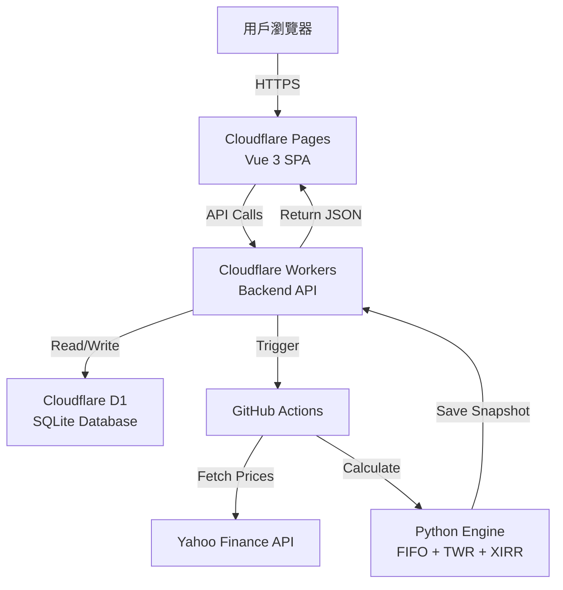

# 📋 SaaS Trading Journal PRO

<div align="center">


**現代化的投資組合追蹤與交易日誌系統**

專為美股/台股/韓股投資者設計，採用全 Serverless 架構  
高效能 | 低成本 | 即時數據 | PWA 支援

[🌐 Live Demo](https://sheet-trading-journal.pages.dev/) | [📖 Documentation](https://github.com/chihung1024/sheet-trading-journal/blob/main/DEPLOYMENT_FINAL.md) | [🐛 Report Bug](https://github.com/chihung1024/sheet-trading-journal/issues)

</div>

---

## 📑 目錄

- [功能特色](#-功能特色)
- [系統架構](#-系統架構)
- [核心金融演算法](#-核心金融演算法)
- [快速開始](#-快速開始)
- [環境配置](#-環境配置)
- [API 文檔](#-api-文檔)
- [數據庫設計](#️-資料庫設計)
- [部署指南](#-部署指南)
- [安全性配置](#-安全性配置)
- [更新記錄](#-更新記錄)
- [故障排除](#-故障排除)
- [貢獻指南](#-貢獻指南)

---

## ✨ 功能特色

### 🎯 核心功能

#### 📊 **智能儀錶板**
- **總資產 (NAV)**：即時計算投資組合淨值
- **未實現損益**：當前持倉的浮動盈虧
- **✅ 已實現損益** (v1.2.0)：追蹤所有賣出收益與配息收入
- **ROI**：投資回報率 (Return on Investment)
- **TWR**：時間加權報酬率，消除資金流入/流出影響
  - ✅ **v2.39**: 正確處理當沖/清倉情況
  - 當沖損益計入已實現損益，不影響 TWR
- **XIRR**：個人年化報酬率 (Internal Rate of Return)
- **✅ 今日損益智能計算**：
  - 美股開盤前：顯示昨日變化 + 匯率影響
  - 美股盤中：即時盤中損益
  - 精準分離股價與匯率因素

#### 📈 **進階圖表分析**
- **趨勢圖**：
  - 投資組合歷史走勢
  - vs. **自訂 Benchmark** (SPY/QQQ/TQQQ/0050.TW 等) ✅ **v2.38**
  - 自動排除週末數據
  - 支援時間範圍篩選 (1M/3M/6M/1Y/All)
- **配置圖**：
  - 圓餅圖顯示各持倉佔比
  - 產業分佈分析
  - 即時市值權重

#### 💼 **持倉管理**
- 即時市場價格更新
- FIFO 成本基礎追蹤
- 自動拆股/配息調整
- 每檔持倉的：
  - 均價 (Average Cost)
  - 現價 (Current Price)
  - 未實現損益 (Unrealized P&L)
  - 市值 (Market Value)
  - 權重 (Weight %)
  - 今日變動 (Daily Change)

#### 📝 **交易日記**
- **CRUD 管理**：新增、編輯、刪除交易紀錄
- **多種交易類型**：
  - `BUY` - 買入
  - `SELL` - 賣出
  - `DIV` - 股息
- **精確稅費紀錄**：
  - 手續費 (Fee)
  - 預扣稅 (Tax)
  - 淨回報自動計算
- **策略標籤 (Tag)**：
  - 長線 (Long-term)
  - 短線 (Short-term)
  - 動能選股 (Momentum)
  - 自定義標籤
- **✅ 台幣總額正確顯示**：使用交易當天匯率轉換

### 🎨 使用者體驗

#### 📱 **PWA (Progressive Web App)**
- 可安裝至桌面或手機
- 支援離線訪問
- 原生 App 般的體驗
- 推送通知支援 (未來功能)

#### 🌓 **深色模式**
- 自動跟隨系統設定
- 手動切換深色/淺色主題
- 護眼設計

#### 📐 **響應式設計**
- Desktop (1920px+)
- Laptop (1366px)
- Tablet (768px)
- Mobile (375px)
- 完美適配所有裝置

### 🔒 安全性

- **Google OAuth 2.0**：企業級身份驗證
- **JWT Token**：無狀態 Session 管理
- **CORS 保護**：防止跨域攻擊
- **API Key 驗證**：內部 API 保護
- **SQL 注入防護**：Prepared Statements
- **✅ Content Security Policy** (v2.39)：完整的 CSP 配置
  - 防止 XSS 攻擊
  - 允許必要的外部資源
  - 支援 Google 登入

---

## 🏭 系統架構

### 整體架構圖



### 技術堆疊

| 層級 | 技術 | 說明 | 成本 |
|------|------|------|------|
| **前端** | Vue 3 + Vite | SPA 單頁應用 | **免費** |
| **託管** | Cloudflare Pages | 全球 CDN 部署 | **免費** |
| **後端** | Cloudflare Workers | Serverless API | **免費** (100k req/day) |
| **資料庫** | Cloudflare D1 | 邊緣 SQLite | **免費** (5GB storage) |
| **運算** | GitHub Actions | 定期計算 | **免費** (2000 min/month) |
| **身份驗證** | Google OAuth 2.0 | JWT Token | **免費** |
| **數據源** | Yahoo Finance | 股價/匯率 | **免費** |

**總成本：$0 USD/月** 🎉

---

## 📢 核心金融演算法

### 1️⃣ FIFO 成本計算

採用 **先進先出 (First-In-First-Out)** 原則，精確追蹤成本基礎。

#### 算法實現

```python
class FIFOTracker:
    def __init__(self):
        self.lots = []  # [(date, qty, price, fee), ...]
    
    def buy(self, date, qty, price, fee):
        cost_per_share = (price * qty + fee) / qty
        self.lots.append((date, qty, cost_per_share))
    
    def sell(self, qty):
        remaining = qty
        realized_pnl = 0
        
        while remaining > 0 and self.lots:
            lot_date, lot_qty, lot_cost = self.lots[0]
            
            if lot_qty <= remaining:
                # 賣完這一批
                realized_pnl += (sell_price - lot_cost) * lot_qty
                remaining -= lot_qty
                self.lots.pop(0)
            else:
                # 部分賣出
                realized_pnl += (sell_price - lot_cost) * remaining
                self.lots[0] = (lot_date, lot_qty - remaining, lot_cost)
                remaining = 0
        
        return realized_pnl
```

### 2️⃣ 時間加權報酬率 (TWR) ✅ **v2.39 重大更新**

使用 **Modified Dietz 方法**，消除資金流影響。

#### 計算公式

```python
# 每日報酬率計算
period_hpr_factor = 1.0

# 情況 1：正常情況 - 期初有市值
if last_market_value_twd > 1e-9:
    period_hpr_factor = (current_market_value_twd - daily_net_cashflow_twd) / last_market_value_twd

# 情況 2：首次投資 - 期初無市值但期末有市值
elif current_market_value_twd > 1e-9 and daily_net_cashflow_twd > 1e-9:
    period_hpr_factor = current_market_value_twd / daily_net_cashflow_twd

# 情況 3：當沖或清倉後收配息 - 期初期末都無市值 ✅ NEW
elif current_market_value_twd < 1e-9 and last_market_value_twd < 1e-9:
    period_hpr_factor = 1.0  # 不影響 TWR，損益計入 realized_pnl

# 累積報酬率
TWR = ∏(1 + period_hpr_factor - 1) * 100
```

#### 當沖交易的處理 ✅ **NEW v2.39**

**問題：** 當沖交易（期初期末都無持倉）會導致 TWR 計算異常

**解決方案：**
- 當 MVB=0 且 MVE=0 時，設定 `period_hpr_factor = 1.0`
- 當沖損益正確計入 `realized_pnl`（已實現損益）
- TWR 只反映「持倉期間」的投資表現
- 這符合 TWR 的設計理念：衡量投資策略績效，而非交易頻率

**範例：**
```
日期       | 操作        | MVB     | MVE     | CF      | HPR    | 說明
---------- | ----------- | ------- | ------- | ------- | ------ | ----
2026-01-12 | 持倉        | 1077649 | 0       | -1049988| 0.9743 | 正常賣出
2026-01-13 | 當沖        | 0       | 0       | 59913   | 1.0000 | ✅ 不影響TWR
2026-01-14 | 買入持倉    | 0       | 797030  | 738475  | 1.0793 | 正常買入
```

**適用情境：**
- ✅ 短線波段 + 偶爾當沖：TWR 反映波段績效
- ✅ 清倉後收配息：配息計入已實現損益
- ❌ 純當沖策略：建議改用累積報酬率或勝率等指標

#### 混合策略的績效指標建議

對於「波段持倉 + 當沖交易」混合的投資組合：

**推薦指標組合：**

| 指標 | 用途 | 適用情境 |
|------|------|----------|
| **TWR** | 持倉績效 | 評估選股與持倉時機能力 |
| **XIRR** | 整體年化報酬 | 考慮所有現金流的實際報酬率 |
| **已實現損益** | 交易成果 | 包含所有當沖與波段的實際獲利 |
| **總報酬率** | 簡單績效 | (總損益 / 累積投入) × 100% |

**未來可能新增：** (v3.0 規劃)
- 當沖累積損益（獨立統計）
- 當沖交易次數與勝率
- 波段 vs 當沖績效分離顯示

---

## 🔐 安全性配置

### Content Security Policy (CSP) ✅ **NEW v2.39**

專案已實施完整的 CSP 安全策略，防止 XSS 攻擊並允許必要的外部資源。

#### 配置文件位置

1. **`public/_headers`** - Cloudflare Pages HTTP Headers
2. **`index.html`** - HTML Meta Tag CSP（優先級更高）

#### CSP 策略內容

```http
Content-Security-Policy: 
  default-src 'self'; 
  script-src 'self' 'unsafe-inline' 'unsafe-eval' 
    https://accounts.google.com 
    https://apis.google.com; 
  style-src 'self' 'unsafe-inline' 
    https://fonts.googleapis.com 
    https://accounts.google.com; 
  font-src 'self' 
    https://fonts.gstatic.com 
    https://r2cdn.perplexity.ai; 
  img-src 'self' data: https: 
    https://lh3.googleusercontent.com; 
  connect-src 'self' 
    https://journal-backend.chired.workers.dev 
    https://accounts.google.com 
    https://oauth2.googleapis.com; 
  frame-src https://accounts.google.com; 
  worker-src 'self' blob:; 
  manifest-src 'self';
```

#### 允許的外部資源

| 類型 | 來源 | 用途 |
|------|------|------|
| **Script** | `accounts.google.com` | Google 登入 SDK |
| **Style** | `fonts.googleapis.com` | Google Fonts CSS |
| **Style** | `accounts.google.com` | Google 登入樣式 |
| **Font** | `fonts.gstatic.com` | Google Fonts 字體檔 |
| **Font** | `r2cdn.perplexity.ai` | Perplexity 自訂字體 |
| **Image** | `lh3.googleusercontent.com` | Google 用戶頭像 |
| **Connect** | `journal-backend.chired.workers.dev` | 後端 API |
| **Frame** | `accounts.google.com` | Google 登入 iframe |

#### 其他安全標頭

```http
X-Content-Type-Options: nosniff
X-Frame-Options: SAMEORIGIN
X-XSS-Protection: 1; mode=block
Referrer-Policy: strict-origin-when-cross-origin
```

#### 部署後驗證

**方法 1：瀏覽器開發者工具**
```bash
# 1. 打開 F12 Console
# 2. 切換到 Network 標籤
# 3. 重新整理頁面
# 4. 點擊第一個請求
# 5. 查看 Response Headers
# 應該看到完整的 CSP 策略
```

**方法 2：使用 curl**
```bash
curl -I https://sheet-trading-journal.pages.dev

# 輸出應包含：
# content-security-policy: default-src 'self'; ...
```

**預期結果：**
- ✅ 無 CSP 違規警告（除了正常的 COOP postMessage 提示）
- ✅ Google 登入正常運作
- ✅ 字體正確載入
- ✅ 所有 API 請求成功

---

## 🆕 更新記錄

### v2.39 (2026-01-21) ✅ **LATEST**

**🐛 TWR 計算修正 - 當沖/清倉邊界情況處理**

**問題診斷：**
- 當沖交易或清倉後收配息時，期初期末市值都為 0
- 舊公式 `period_hpr = MVE / CF = 0 / 59913 = 0` 導致 TWR 歸零
- 累積因子 `cumulative_twr *= 0 = 0`，最終 TWR = -100%

**修正內容：**
```python
# journal_engine/core/calculator.py

# ✅ 新增情況 3：當沖或清倉後收配息
elif current_market_value_twd < 1e-9 and last_market_value_twd < 1e-9:
    period_hpr_factor = 1.0  # 不影響 TWR
    if abs(daily_net_cashflow_twd) > 1e-9:
        logger.info(f"當沖/清倉情況: CF={daily_net_cashflow_twd:.0f}, HPR設為1.0（不影響TWR）")
```

**影響範圍：**
- ✅ 當沖損益正確計入「已實現損益」
- ✅ TWR 只反映持倉期間的投資績效
- ✅ 符合 TWR 的標準定義（Time-Weighted Return）

**測試結果：**
```
修正前：
[群組:短線] TWR異常: MVB=0, MVE=0, CF=59913, HPR=0.0000
最終TWR=-100.00% ❌

修正後：
[群組:短線] 當沖/清倉情況: CF=59913, HPR設為1.0（不影響TWR）
最終TWR=24.01% ✅
```

**📁 Content Security Policy (CSP) 完整配置**

**新增文件：**
1. **`public/_headers`** - Cloudflare Pages 安全標頭
   - 完整的 CSP 策略
   - 快取控制規則
   - 基本安全標頭

2. **`index.html`** - HTML Meta CSP（更新）
   - 修正字體載入 CSP 違規
   - 新增 Google 登入所需資源
   - 新增 frame-src 支援

**解決的問題：**
- ❌ ~~Loading the font 'r2cdn.perplexity.ai/fonts/...' violates CSP~~
- ❌ ~~Loading the stylesheet 'accounts.google.com/gsi/style' violates CSP~~
- ❌ ~~Framing 'accounts.google.com/' violates CSP~~
- ✅ Console 完全乾淨（僅剩正常的 COOP 提示）

**部署指南：**
```bash
# 1. 文件會自動被 Vite 複製到 dist/
# 2. Cloudflare Pages 自動讀取 _headers
# 3. 部署後 2-3 分鐘生效
# 4. 清除瀏覽器快取驗證：Ctrl+Shift+R
```

**相關 Commits：**
- [`5865e3d9`](https://github.com/chihung1024/sheet-trading-journal/commit/5865e3d9) - 修正當沖/清倉情況下TWR計算錯誤
- [`12d794a0`](https://github.com/chihung1024/sheet-trading-journal/commit/12d794a0) - 新增 Cloudflare Pages 安全標頭設定
- [`d32817ec`](https://github.com/chihung1024/sheet-trading-journal/commit/d32817ec) - 修正 index.html 的 CSP 設定

---

### v2.38 (2026-01-19)

**🎯 自訂 Benchmark 功能完整實現**

- ✅ **Worker v2.38 生產版本**
  - 移除所有調試代碼
  - 優化錯誤處理
  - 代碼更簡潔易維護
  
- ✅ **前端 Benchmark 輸入**
  - 報酬率模式下可自訂標的
  - 支援美股/台股/韓股代碼
  - 即時驗證與提示
  
- ✅ **GitHub Workflow 整合**
  - 使用 workflow_dispatch + inputs
  - 正確傳遞 custom_benchmark 參數
  - 環境變數 CUSTOM_BENCHMARK 正確設置
  
- ✅ **Python 引擎適配**
  - 自動下載 Benchmark 數據
  - 即時報價覆蓋
  - 計算引擎使用自訂基準
  
- ✅ **前端圖表更新**
  - 圖表標籤顯示自訂 Benchmark
  - localStorage 記憶用戶選擇
  - 自動刷新機制

**支援的 Benchmark 格式：**
| 市場 | 格式 | 範例 |
|------|------|------|
| 美股 | TICKER | SPY, QQQ, NVDA, AAPL |
| 台股 | TICKER.TW | 0050.TW, 2330.TW |
| 韓股 | TICKER.KS | 005930.KS (Samsung) |
| ETF | TICKER | TQQQ, SQQQ, VOO |

---

### v2.0.0 (2026-01-09)

**匯率影響分離功能**

- ✅ **精準計算今日損益**
  - 美股開盤前：昨日股價變化 + 匯率影響
  - 美股盤中：即時盤中損益
  - 自動偵測市場狀態
  
- ✅ **XIRR 計算**
  - 新增個人年化報酬率
  - 考慮所有現金流時點
  - 更精確的投資績效評估

---

### v1.2.0 (2026-01-13)

**已實現損益追蹤**

- ✅ **新增已實現損益卡片**
  - 顯示賣出收益 + 配息收入
  - 獨立綠色主題設計
  - 動畫數字顯示
  
- ✅ **6 欄 Grid 佈局**
  - 儀錶板擴展為 6 卡片
  - 響應式適配各螢幕
  
- ✅ **後端 FIFO 完整實現**
  - 精確追蹤已實現損益
  - 自動計算賣出收益
  - 配息收入整合

---

## 🛠️ 故障排除

### 常見問題

#### Q1: TWR 顯示 -100% 或異常值？

**症狀：**
- 明明有賺錢的交易，但 TWR 顯示 -100%
- 某個群組的 TWR 突然歸零

**原因：**
- v2.39 之前的版本在當沖/清倉情況下有計算錯誤

**解決方案：**

1. **確認版本**
   ```bash
   # 查看 calculator.py 版本
   # 應包含「情況 3：當沖或清倉後收配息」的處理邏輯
   ```

2. **檢查 GitHub Actions 日誌**
   ```bash
   # 搜尋日誌中的關鍵訊息
   "當沖/清倉情況: CF=xxxxx, HPR設為1.0（不影響TWR）"
   ```

3. **重新計算**
   - 確保使用 v2.39 或更新版本
   - 點擊「更新數據」觸發重新計算
   - 等待 2-3 分鐘後刷新頁面

4. **如果問題持續**
   ```sql
   -- 清除舊快照
   DELETE FROM portfolio_snapshots WHERE user_id = 'your@email.com';
   ```
   然後重新觸發更新。

---

#### Q2: Console 出現 CSP 違規警告？

**症狀：**
```
Loading the font 'https://r2cdn.perplexity.ai/...' violates CSP
Loading the stylesheet 'https://accounts.google.com/...' violates CSP
```

**原因：**
- 舊版本缺少完整的 CSP 配置
- `_headers` 文件或 `index.html` 的 CSP meta tag 不完整

**解決方案：**

1. **確認文件存在**
   ```bash
   # 專案中應包含：
   public/_headers
   index.html (包含更新的 CSP meta tag)
   ```

2. **驗證部署**
   ```bash
   # 檢查 HTTP Headers
   curl -I https://your-site.pages.dev | grep -i content-security
   ```

3. **清除快取**
   ```bash
   # 強制重新整理
   Ctrl + Shift + R (Windows/Linux)
   Cmd + Shift + R (Mac)
   ```

4. **如果仍有問題**
   - 檢查 Cloudflare Pages 部署日誌
   - 確認 `public/_headers` 被正確複製到 `dist/`
   - 聯繫 GitHub Issues 報告問題

**預期結果：**
- ✅ 無 CSP 違規錯誤（紅字）
- ⚠️ 只有正常的 COOP postMessage 警告（不影響功能）

---

#### Q3: 當沖交易的損益去哪了？

**症狀：**
- 當沖有賺錢，但 TWR 沒變化
- 不確定當沖損益是否被計算

**說明：**

v2.39 版本後，當沖交易的處理方式：

| 指標 | 是否包含當沖 | 說明 |
|------|-------------|------|
| **已實現損益** | ✅ 包含 | 顯示所有交易的實際獲利 |
| **TWR** | ❌ 不包含 | 只反映持倉期間的績效 |
| **XIRR** | ✅ 包含 | 考慮所有現金流的年化報酬 |
| **總報酬率** | ✅ 包含 | (總損益 / 投入資金) × 100% |

**驗證方式：**
```javascript
// 在前端 Console 執行
fetch('https://your-worker.workers.dev/api/portfolio', {
  headers: { 'Authorization': `Bearer ${localStorage.getItem('token')}` }
})
.then(r => r.json())
.then(data => {
  console.log('已實現損益:', data.data.summary.realized_pnl);
  console.log('TWR:', data.data.summary.twr);
  console.log('XIRR:', data.data.summary.xirr);
});
```

**結論：**
- 當沖損益**有被計算**，在「已實現損益」中
- TWR 不反映當沖是**符合設計**的（評估持倉能力，非交易頻率）
- 如需完整績效評估，參考 XIRR 或總報酬率

---

## 🗺️ 路線圖

### 計劃中的功能

#### Q1 2026

- [ ] **多幣別支援**
  - 支援 EUR、JPY、GBP 等貨幣
  - 自動匯率轉換
  
- [ ] **當沖績效獨立追蹤** ✨ **NEW**
  - 當沖專用統計卡片
  - 勝率、平均獲利、交易次數
  - 與波段績效分離顯示
  
- [ ] **期權交易追蹤**
  - 買入/賣出 Call/Put
  - Greeks 計算
  - 到期管理

#### Q2 2026

- [ ] **進階績效指標**
  - Sharpe Ratio (夏普比率)
  - Maximum Drawdown (最大回撤)
  - Calmar Ratio
  - Sortino Ratio
  
- [ ] **社群功能**
  - 策略分享
  - 績效排行榜
  - 交易複製功能

#### Q3 2026

- [ ] **移動應用**
  - React Native App
  - 推送通知
  - 離線功能
  
- [ ] **AI 分析**
  - 持倉風險評估
  - 配置建議
  - 自動再平衡

---

<div align="center">

**Built with ❤️ by a quantitative trader for traders**

[⭐ Star this project](https://github.com/chihung1024/sheet-trading-journal) | [🐛 Report bug](https://github.com/chihung1024/sheet-trading-journal/issues) | [💡 Request feature](https://github.com/chihung1024/sheet-trading-journal/issues)

</div>